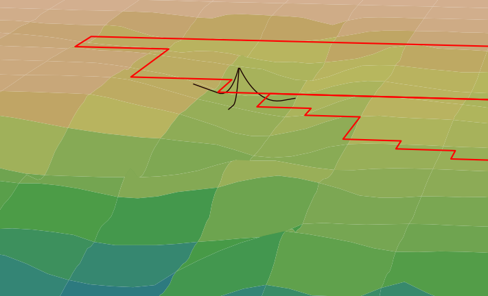

# FAModel

The FAModel (or Floating Array Model) package serves as a high-level library for
modeling a floating wind array. It combines site condition information and a 
description of the floating array design, and contains functions for evaluating
the array's behavior considering the site conditions. For example, it combines
information about site soil conditions and an array's anchor characteristics to
estimate the holding capacity of each anchor.

The library works in conjunction with the tools RAFT, MoorPy, and FLORIS to model floating
wind turbines, mooring systems, and array wakes respectively.

In addition to the code, this repository defines a 
[Floating Array Ontology](https://github.com/FloatingArrayDesign/FAModel/tree/main/famodel/ontology), 
which provides a standardized description format for floating wind farms. 

An example of use of these tools to model three mooring lines over the bathymetry 
of the Humboldt lease area is shown below.



See example use cases in our [examples](https://github.com/FloatingArrayDesign/FAModel/tree/main/examples/README.md) folder.

## Pre-installation Requirements
The FAModel package is built entirely in Python. It is recommended that users familiarize themselves with basic Python commands before use.
It is important to understand the general structure of FAModel and how to access models and stored information. Please see the model structure 
document (./famodel/README.md).


## Installation
To install FAModel itself, first clone the FAModel repository.

The dependencies required by FAModel depend on how it is used. To install all
possible required dependencies, you can create a 
new python virtual environment based on the included yaml listing the required 
dependencies.

In the terminal (Anaconda Powershell Prompt), clone this repository to a 
directory of your choice, navigate into the main folder of the repository, and 
run the following command:

    conda env create -f famodel-env.yaml

This command will install all the dependencies required to run FAModel.
Activate your virtual environment before using FAModel with ```conda activate famodel-env```

To install the FAModel package in your environment, enter the 
following in the command line from the FAModel directory.

For development use:

run ```python setup.py develop``` or ```pip install -e .``` from the command line in the main FAModel directory.

For non-development use:

run ```python setup.py``` or ```pip install .``` from the command line in the main FAModel directory.

** At this time, FAModel requires the latest MoorPy development branch version to be used. **
Therefore, you must install MoorPy with ```git clone https://github.com/NREL/MoorPy.git```
then navigate to the MoorPy folder and checkout the development branch with ```git checkout dev```
Finally, install this version into your environment with ```pip install -e .```.
Make sure your virtual enviroment is activated before installing MoorPy.


## Subpackages

The library has a core Project class for organizing information, classes for each component of an array and an evolving
collection of subpackages for specific functions. The current subpackages are:

- anchors: contains modules for anchor capacity calculations, in addition to the anchor class
- failures: contains modules for failure modeling with graph theory, and allows for enactment of a failure mode in integrated FAModel tools such as MoorPy and RAFT.
- seabed: contains modules for seabed bathymetry and boundary information

Please navigate into the subfolders above for additional information.

## Getting Started
The easiest way to create an FAModel project is to provide the array information in an ontology yaml file. FAModel has been designed to work with a specific ontology yaml setup, which is described in detail in the [Ontology ReadMe](./famodel/ontology/README.md).

The [example driver file](./famodel/example_driver.py) creates an FAModel project from a pre-set ontology file and shows the syntax and outputs of various capabilities. For guidance on creating your own ontology yaml file, it is recommended to read through the [Ontology ReadMe](./famodel/ontology/README.md), then either adapt one of the ontology samples or fill in the ontology template. 

The [FAModel core readme](./famodel/README.md) describes the FAModel class structure, as well as the properties and methods of each component class. 

There are some limited helper functions to auntomatically fill in sections of a yaml from a moorpy system or a list of platform locations. See [FAModel helpers](./famodel/helpers.py) for the full list of yaml writing capabilities. Many of these are a work in progress.


## Authors

The NREL Floating Wind Array Design team.