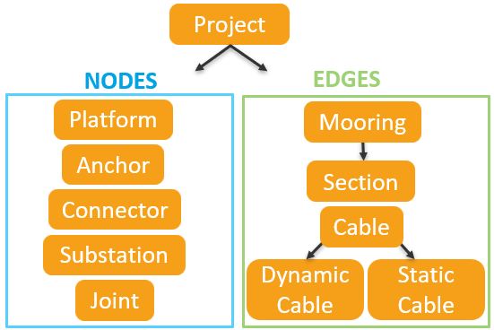
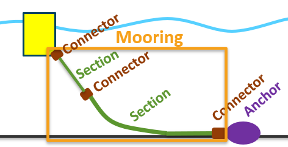
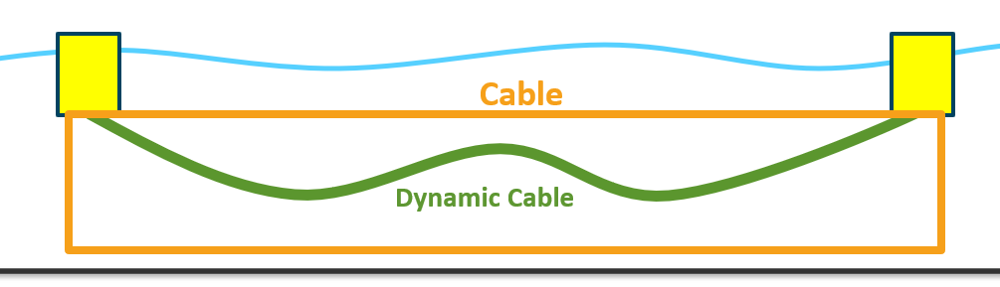
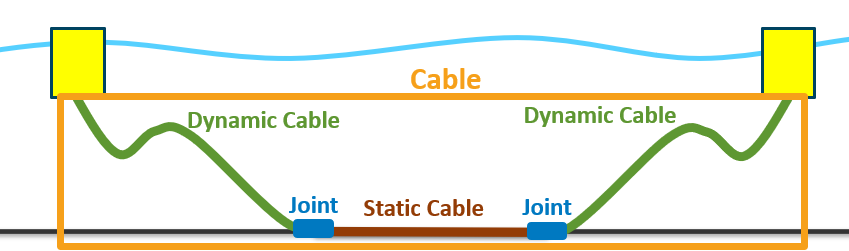

# Project class and floating array subpackages

This in-progress package currently includes an
overall floating array project class, classes for components of a floating array, and a series of data
structures and functions for bathymetry, soil conditions, and other site conditions.

This package integrates various open-source array modeling tools such as [RAFT](https://openraft.readthedocs.io/en/latest/), [MoorPy](https://moorpy.readthedocs.io/en/latest/), 
and [FLORIS](https://nrel.github.io/floris/). FAModel can automatically create a model of the array in any of these tools.

To enable organized storage of floating array information and functions specific to components, each component of an array 
has a dedicated class (i.e. Mooring class, Turbine class, etc).

## Overview
This document provides information on the FAModel class structure, then delves into the Project class methods and properties, and finally provides an overview of the FAModel Ontology YAML setup.
### Class Structure
The structure of the project class and component classes is described in the following sections:
* [Project Class](#project-class)
* [Base Classes](#base-classes)
  * [Node Class](#node-class)
  * [Edge Class](#edge-class)
* [Platform Class](#platform-class)
* [Mooring Class](#mooring-class)
  * [Section Class](#section-class)
  * [Connector Class](#connector-class)
* [Anchor Class](#anchor-class)
* [Cable Class](#cable-class)
  * [Dynamic Cable Class](#dynamic-cable-class)
  * [Static Cable Class](#static-cable-class)
  * [Joint Class](#joint-class)
* [Turbine Class](#turbine-class)
* [Substation Class](#substation-class)

### Project Information
A full description of the project class methods and properties is found in the following sections:
* [Project Class Methods](#project-methods)
* [Project Class Properties](#project-properties)

### FAModel Ontology
An overview of the Ontology YAML file setup is found in the following section.
* [FAModel Ontology Overview](#ontology-yaml)
  
For a full description of the ontology yaml file with examples, see [Ontology ReadMe](./ontology/README.md)

## Project Class

The Project class provides a standard data structure that combines
design information (through an ontology yaml file or RAFT) and site information. 
Currently the site information focuses on the seabed and lease area
boundary. In the future, metocean data will also be included. The design information 
includes [anchors](#anchor-class), [platforms](#platform-class), [turbines](#turbine-class), [substations](#substation-class), [cables](#cable-class), and [mooring lines](#mooring-class). Components of the array each have a dedicated class. All component classes inherit from either an edge or a node 
base class. Base classes are described in more detail in [Base Classes](#base-classes). The class structure is visualized below:  

  
The project class includes a grid over which seabed bathymetry and
soil information is stored. The soil information follows a property
parameterization with the following fields:
- soil_class - soil classification name:
  - soft clay
  - medium clay
  - hard clay
  - sand
- soil_gamma - soil effective unit weight [kPa] (all soils)
- soil_Su0   - undrained shear strength at mudline [kPa] (clay soils)
- soil_K     - undrained shear strength gradient [kPa/m] (clay soils)
- soil_alpha - soil skin friction coefficient [-] (clay soils)
- soil_phi   - angle of internal friction [deg] (sand soils)

For details on the properties and methods of the Project class, see [Project class methods](#project-methods) and [Project class properties](#project-properties)

[Back to Top](#class-structure)

## Base Classes
There are two base classes from which all array component classes inherit: Nodes and Edges. 
These classes provide methods to create, look up, and remove attachments between component objects.

Nodes are classes that can be described by a point in space, such as a platform or anchor. Edges are 
classes that connect two nodes, such as a mooring line or cable. 

### Node Class
The Node class contains the following properties:

 - id          : unique ID of the Node object
 - attachments : dictionary of objects attached to the node (usually Edges). The key is the id of the attached object,
                 and the value is a dictionary of information on the attached object, set up as shown below:
				 {'obj': attached object, 'id': id of attached object, 'r_rel': relative location of attached object,
				  'type': 'node'}
 - part_of     : Edge object this node is a subcomponent of (if applicable)
 - r           : xy position of Node [m]
 - theta       : heading of Node [rad]
 - R           : rotation matrix
				 

The Node class methods are:
 - isAttached      : check if an object is attached to the node
 - attach          : attach an object to this node
 - detach          : detach a specified object from this node 
 - getTopLevelEdge : returns higher-level edge this node is a part of, if applicable
 - setPosition     : sets position of node, and heading if applicable 

### Edge Class
The Edge class contains the following properties:
  - id            : unique ID of the edge object
  - attached_to   : object(s) either end of the edge is attached to. 
                    This is a list of the objects (not a dictionary like node.attachments), where end A attachment 
					is in the 0th index, and end B attachment object is in the 1st index.
  - rA            : end A location [x,y]
  - rB            : end B location [x,y]
  - part_of       : Edge object this edge is a subcomponent of (if applicable)
  - subcomponents : chain of edges and nodes that make up this edge
  - whole         : boolean, false if sub edges/nodes aren't all connected

The Edge class methods are:
  - isAttachedTo     : checks if specified node is attached to this edge
  - attachTo         : attaches a specified node to end A or end B of this edge
  - detachFrom       : detach a specified end of this edge from what it is attached to
  - addSubcomponents : adds a sequence of alternating nodes and edges as subcomponents of this edge, connecting the 
                       subcomponent objects in the process.
  - getTopLevelEdge  : returns higher-level edge this edge is a part of, if applicable
  - setEndPosition   : sets the position of an edge end 
  - delete           : detach the edge from anything it is attached to 

Edge classes such as Cables and Moorings can be made up of subcomponents that are alternating series of nodes and edges.
For example, a Mooring object with subcomponents Connector-Section-Connector, or a Cable with subcomponents 
DynamicCable-Joint-StaticCable-Joint-DynamicCable. 

[Back to Top](#class-structure)

## Platform Class
The platform class contains properties and methods pertaining to a floating offshore wind turbine platform. The Platform 
class inherits from the Node class. 

The Platform class is described in detail in the [Platform ReadMe file](./platform/README.md).

[Back to Top](#class-structure)

## Mooring Class 
The Mooring class contains properties and methods pertaining to a mooring line of a floating offshore wind turbine. The 
Mooring class inherits from the Edge class. 

A mooring class object contains all of the subcomponents of a line from anchor to fairlead, or from fairlead to fairlead for a shared mooring line. Mooring lines will have subcomponents which alternate between Connector 
objects and Section objects. 

In a chain-polyester line, there would be 5 subcomponents of the Mooring object: 
[Connector, Section, Connector, Section, Connector]

>[!NOTE]
>The anchor is not part of the Mooring object

Detailed information on the Mooring, Section, and Connector classes is provided in the [Mooring ReadMe file](./mooring/README.md)

[Back to Top](#class-structure)

### Section Class 

The section class contains information on a mooring line segment. A mooring line may have multiple materials or properties along the line, and each segment will have its own Section object.
For example: in a chain-polyester-chain line for a semi-taut mooring line, there will be 3 Section objects, one for each segment. These 
Sections are subcomponents of the Mooring object.

[Back to Top](#class-structure)

### Connector Class 

The Connector class contains information on a mooring line connector. Each end of a mooring line will have a Connector object, meaning the minimum number of subcomponents of a Mooring object is 3 (Connector, Section, Connector). There will also be a connector between segments of the mooring line with different properties.

[Back to Top](#class-structure)

## Anchor Class

The Anchor class contains properties and methods of a mooring line anchor. The Anchor class inherits from the Node class.
Anchors may be shared (multiple lines attached to the same anchor). 

Capacity and load functions in the anchors folder 
provide the capacities of an anchor and the loads at its lug location. These functions are called from the Anchor method getAnchorCapacity().
Various anchor types are supported, for detailed information on the Anchor class, as well as capacity and load functions see the [Anchor ReadMe file](./anchors/README.md).

[Back to Top](#class-structure)

## Cable Class

The Cable class contains properties and methods of an intra-array cable. The Cable object is defined as the entirety of 
an electrical cable between two platforms or a platform and an offshore substation. For full details on the Cable class and its subcomponent classes (DynamicCable, StaticCable, Joint), see the [Cable ReadMe file](./cables/README.md)

The Cable class is comprised of
subcomponents. For a suspended cable with no static portion, there is only one subcomponent - a DynamicCable object, as shown below: 

For cables with dynamic and static portions, there will be multiple subcomponents, as the static portion 
of the cable willl be a StaticCable object, and there will be a Joint object at each point where the  For example, a Cable object may 
have subcomponents in the order DynamicCable-Joint-StaticCable-Joint-DynamicCable.

>[!Note]
>Unlike the Mooring class, there does not need to be a Joint at the platform/substation connections, only between a static and dynamic cable.

### Dynamic Cable Class
The DynamicCable class contains properties and methods for a cable section that will experience motion. These cables often contain buoyancy modules to create a buoyant section that relieves tensions when the platform it is connected to moves.

The segments of the dynamic cable with buoyancy modules is not split into its own subcomponents because the dynamic cable is all one portion. Instead, the design dictionary contains information on the location of buoyancy modules along the cable length. Joint locations are determined based on the heading and span of the DynamicCable.

### Static Cable Class
The StaticCable class contains properties and methods for a cable section that will not move (generally these cables are buried or otherwise prevented from moving along the seabed). Routing can be specified for each StatiCable between its end Joints.

### Joint Class
The Joint class contains information on a joint between cable types. The Joint locations are set based on the seabed endpoint of the connected DynamicCable.

[Back to Top](#class-structure)

## Turbine Class
The Turbine class contains properties and methods for a floating offshore wind turbine (including RNA, tower, and any transition pieces).

For a complete description of the Turbine class, see the [Turbine ReadMe file](./turbine/README.md)

[Back to Top](#class-structure)

## Substation Class
The substation class contains information on the offshore substation. Currently, the 
capabilities of the substation class is very minimal, but in the future will include detailed information on the substation design.
For a complete description of the Substation class, see the [Substation ReadMe file](./substation/README.md)

[Back to Top](#class-structure)

## Subpackages

### Anchors

The anchors subpackage contains modules for anchor capacity calculations
as a function of soil type. It has the following:
- level-1 capacity curves for the following general anchor types and soil classes:
  - DEAs in soft clay, medium clay, hard clay, or sand
  - VLAs in soft clay or medium clay
  - Suction anchors in soft clay or medium clay
  - SEPLAs in soft clay
- level-2 capacity functions for select anchor types and quantitative
  soil properties
- a general anchor capacity calculation 'switchboard' that routes to the
  appropriate functions for specified anchor and soil types.
  
### Seabed

The seabed subpackage provides a set of functions for inputting and 
processing "seabed" information, including bathymetry, soil properties,
and other spatial properties of a lease area such as the lease area
boundary. 

## Project Methods

### loadDesign

Load in the design information from a YAML file or dictionary. Loads in cables,
mooring lines, anchors, platforms, turbines, and substations. Creates objects for each component in the array. Dictionaries of mooring line objects, anchor objects, and platform objects, cable objects, turbine objects, and substation objects 
are created and stored in the project (array level) object.

### loadSite

Load site information from a YAML file or dictionary. Loads in bathymetry from a file using
the loadBathymetry method, or from xyz data. Loads in boundaries from a file using the loadBoundary 
method, or loads in the boundaries from xy data. Additional site information such as general depth,
water density, air density, and air dynamic viscosity are also loaded here.

### setGrid
        
Set up the rectangular grid over which site or seabed
data will be saved and worked with. Directions x and y are 
generally assumed to be aligned with the East and North 
directions, respectively, at the array reference point.
    
### loadBoundary
Load a lease area boundary for the project from an input file.
        
### loadBathymetry

Load bathymetry information from an input file (format TBD), convert to
a rectangular grid, and save the grid to the floating array object (TBD).
        
### loadSoil

Load geoetechnical information from an input file (format TBD), convert to
a rectangular grid, and save the grid to the floating array object (TBD).

The input file should provide rows with the following entries:
- x coordinate
- y coordinate
- class  - soil classification name ('clay', 'sand', or 'rock' with optional modifiers)
- gamma* - soil effective unit weight [kPa] (all soils)
- Su0*   - undrained shear strength at mudline [kPa] (clay 
- K*     - undrained shear strength gradient [kPa/m] (clay 
- alpha* - soil skin friction coefficient [-] (clay soils)
- phi*   - angle of internal friction [deg] (sand soils)

Some (*) parameters are optional depending on the soil class and mode.   

Irregular sampling points will be supported and interpolated to a 
rectangular grid.

### getSoilAtLocation

Interpolate soil properties at specified location from the soil
properties grid and return a dictionary of soil properties that
can be used in anchor capacity calculations.

### calcAnchorCapacity

Compute holding capacity of a given anchor based on the soil
info at its position. The anchor object's anchor properties and
location will be used to determine the holding capacity, which
will be saved to the anchor object.
        
### getDepthAtLocation

Computes the depth at a specified x-y location based on the 
bathymetry grid stored in the project. The seabed normal vector
can also be obtained.

### seabedIntersect

Computes the location at which a ray crosses the seabed

### projectAlongSeabed

Obtain the z-coordinates of a projection along the seabed surface for a set of x-y coordinates.

### makeDistanceMatrix

Computes the horizontal distance between every turbine's undisplaced location 
and returns a matrix of these distances for the array.

### calcCableLength

Calculates the cable's length based on its routing

### checkCableExclusions

Checks whether a cable crosses over any exclusions or other out of bounds areas

### plot3d

Plots aspects of the Project object in matplotlib 3D

### plot2d

Plots aspects of the Project object into matplotlib in 2D

### getMoorPyArray

Creates an array in MoorPy based on the mooring, anchor, connector, and platform objects listed 
in the project object. Also allows the option to plot the resulting MoorPy array.

### getFromDict

Streamlines getting values from the design dictionary from YAML file, including error checking.

## Project Properties

## Ontology YAML

Contains all information on the design of the floating array.
For a detailed description of the Ontology YAML by section with examples, see [Ontology ReadMe](./ontology/README.md)

Key information for building the floating array design yaml file by section:

### Site
This section contains information about the site, either through listing of data file names, or site information listed in table format.
Subsections include general information, boundaries, exclusions, bathymetry, seabed, metocean, and resource.

### Array
This section contains a table of information about the turbine array layout. Each row 
in the table represents one turbine. The turbineID refers to the turbine type in the turbine 
section, the platformID refers to the platform type from the platform section, the mooringID refers 
to the mooring system number in the mooring_systems section. The x_location and y_location refer to the 
xy coordinates for the center of the platform, and the heading adjust describes any rotation of the platform's 
mean position.

If 0 is provided for the mooring system ID, this designates that the mooring details for that 
turbine are in the array_mooring section, which is generally in use for shared moorings or anchors.

### Array Mooring
This section contains array-level data on anchors and lines. Mooring lines listed here are not part of the mooring_systems section, as these are either shared lines or lines connected to shared anchors. The anchors are listed in the anchor_data table,
where the xy location, anchor type, and embedment information are provided. The line_data table provides 
information on each line, including which platform row number (from the array table) and/or anchor number (from the
anchor_data table) is attached to the line, what the headings for each end are, and whether there is any length adjustment.

headingA refers to the mooring heading of the turbine the line is connected to for end A of the line, if it is connected to 
a platform (for all non-shared moorings, end A is connected to the anchor, and in this instance NA can be used for headingA). 
Similarly, headingB refers to the mooring heading of the platform the line is connected to for end B of the line. End B must be 
connected to a platform.

### Array Cables

### Turbines

### Platforms

### Mooring Systems
This section lists the mooring system for each turbine, not including any shared lines or lines with shared anchors.
The list of mooring systems is numbered by msX where X is the mooring system ID number provided in the array table.
Each mooring system provides the ID of the configuration, the heading, the anchor type, and whether there is any length adjustment.

Platforms that have shared mooring or shared anchors for some of their lines may have a listing in the mooring system (if the MooringID 
is not 0 for that platform in the array section), but this mooring system will only contain mooring line configurations that are not shared 
moorings or anchors.

### Mooring Line Configurations
This section lists the mooring configurations that are called out i nthe mooring_systems section or the array_mooring section. For each 
configuration, a descriptive name, fairlead and anchor radius, fairlead depth, and list of sections is provided. Items in the sections list 
may be mooring lines (in which case type and length are given as keys) or connectors (in which case the key connectorType must be used). Connectors are 
optional, and some, all, or none of the connectors for a line may be provided. However, only one connector may be listed between each line type listed.

**Please note that the order of the sections list is very important. Entries in the sections list must be provided in order from end A 
(anchor end for non-shared lines) to end B (fairlead end).**

For shared line configurations, a key 'symmetric' may be used to describe whether the provided line configuration is half of a symmetric line 
(symmetric: True) or a full line configuration (symmetric: False) in the same level as the name and radii information. If a connector is given 
as the last item in the section list for a shared symmetric line, it is assumed that the provided connector is located in the center of the line.

### Mooring Line Types
This section provides design details for each line type listed in the line configurations section. Necessary information to be listed for each
line type includes nominal diameter, volume-equivalent diameter, mass per unit length, quasi-static stiffness, minimum breaking load, and material. 
Optional information includes cost per unit length, dynamic stiffness, dynamic stiffness mean-load multiplier, and material details.

### Mooring Connector Types
This section provides design details for each mooring connector type listed in the line configurations section. There are no requirements on what
must be listed for each connector, but optional inputs include mass, volume, and CdA (product of cross sectional area and drag coefficient).

### Anchor Types
This section provides design detials for each anchor type listed in the mooring_systems section or the array_mooring anchor_data table. There are no 
requirements on what must be listed for each anchor, but optional inputs include diameter, length, mass, area, thickness, and embedment length.

### Cables

### Dynamic Cable Configurations

### Cable Types

### Cable Appendages

### Cable Joints