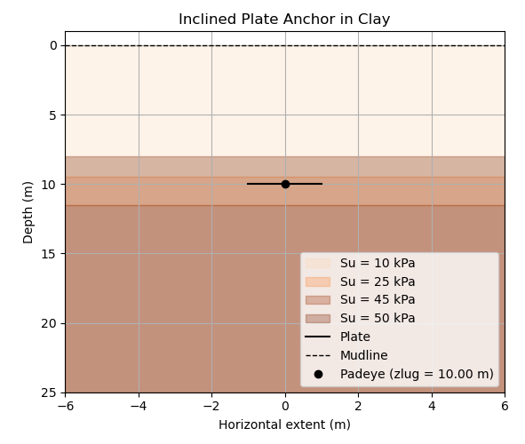
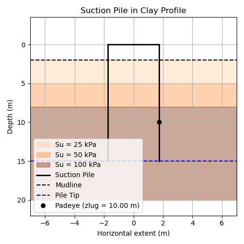
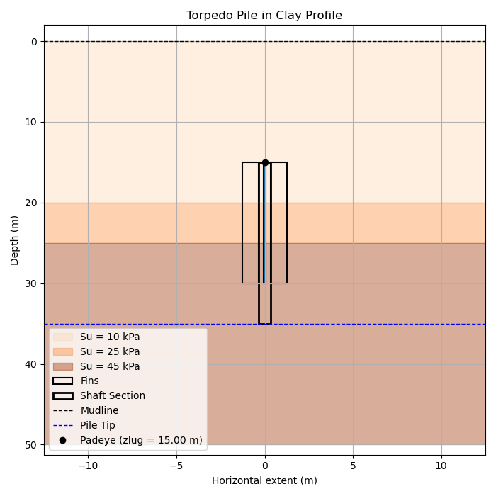
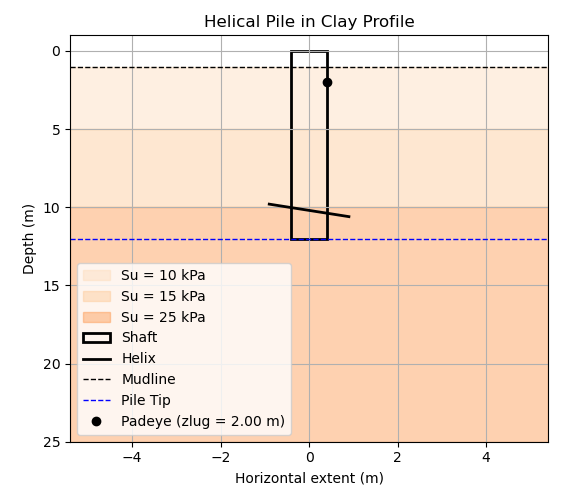
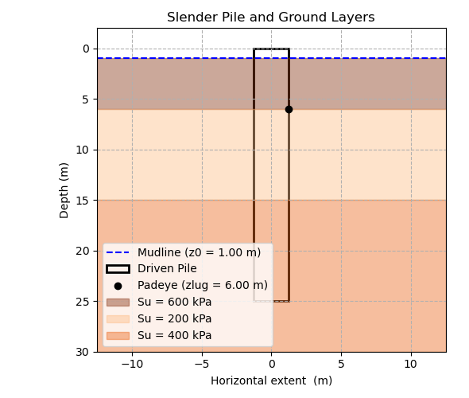
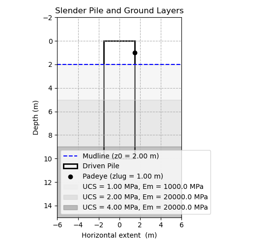

# Anchors Library

This subpackage of FAModel contains the anchor class and all modules for the  capacity under extreme loads and the installation assessments

## Seabed Conditions

Introduction to different soil types

Heterogenous soil (mixed layers). Map of soil properties for horizontal and vertical spatial-variability.

The reference elevation of the pile is the pile head (z = 0 m), from here all elevations are derived. Thus, Z0 (mudline elevation) is the distance between the pile head and the top of the first layer of soil. Main padeye locations depend on their relative elevation to z0, if zlug > z0 mooring line is embedded below the mudline elevation
### Soil properties
##### Input
- profile_map 
	- location_name: CPT or reference in the system (-)
  - x, y: coordinates of the anchor within the lease area (m), (m)
  - layers (at least one): 
    - top, bottom: depth for top and bottom for each layer (m), (m)
    - soil_type: clay/mud, sand and (weak) rock (-)  
    - soil properties: 
      - clay/mud:
        - gamma: submerged soil unit weight (kN/m³)
        - Su: undrained shear strength (kPa) 
      - sand:
        - gamma: submerged soil unit weight: (kN/m³)
        - phi: internal friction angle (deg)
        - Dr: relative density (%)
      - (weak) rock, 
        - UCS: unconfined compressive strength at failure (MPa)
        - Em: rock mass modulus (MPa)

>[!NOTE]
Driven piles are only possible on weak rock, defined here as up to UCS = 5 MPa

> [!IMPORTANT] 
Units within FAModel follow the SI exclusively. The input soil parameters units follow common industry convention. Soil parameters conversion units to Pa and N/m³ take place in the capacity_soils module exclusively. There is no need to convert units.

    profile_map = [
        {
            'name': 'CPT_1',
            'x': 498234, 'y': 5725141,
            'layers': [
                {
                    'top': 1.0, 'bottom': 6.0,
                    'soil_type': 'clay',
                    'gamma_top': 8.0, 'gamma_bot': 8.0,
                    'Su_top': 10, 'Su_bot': 50},
                {
                    'top': 6.0, 'bottom': 15.0,
                    'soil_type': 'sand',
                    'gamma_top': 8.0, 'gamma_bot': 8.0,
                    'phi_top': 32, 'phi_bot': 38,
                    'Dr_top': 70, 'Dr_bot': 75},
                {
                    'top': 15.0, 'bottom': 30.0,
                    'soil_type': 'clay',
                    'gamma_top': 8.0, 'gamma_bot': 9.0,
                    'Su_top': 100, 'Su_bot': 200}]
        }
    ]
    Note:
    - z0 = 1 m, meaning the pile head is 1 m above the mudline
    - soil_type: clay, sand, clay
    - this method allows different soil types and gaps in between soil layers of the same or different soil type
##### Output
- z0: depth of the mudline relative to the pile head (m)
- soil types:
  - clay/mud:
    - f_gamma: effective unit soil weigtht at depth (N/m³)
    - f_Su: undrained shear strength at depth (Pa)
    - f_sigma_v_eff: effective vertical stress at depth (Pa)
    - f_alpha: adhesion factor from API correlation (-)
  - sand:
    - f_gamma: effective unit soil weigtht at depth (N/m³)
    - f_phi: friction angle at depth (deg)
    - f_sigma_v_eff: effective vertical stress at depth (Pa)
    - f_Dr: relative density at depth (%)
    - f_delta: skin friction angle at depth (-)
  - rock:
    - f_UCS: unconfined compressive strength at depth (Pa)
    - f_Em: rock mass modulus at depth (deg)
------------------------------------------------------------------------------

Soil classification for clay, sand and rock can be found in [Soil Classification Parameters](#soil-classification-parameters).
>[!NOTE] 
>Some anchor capacity functions require input loads at the anchor lug point. These loads can be sent in to the getLugLoads() method, or the getAnchorCapacity() method will calculate the loads by calling getLugLoads(). 
The input loads must be maximum or large loads on the anchor.
		
### Soil classification parameters

The soft, medium and hard clay soil classes are distinguished by the following parameter ranges: 
| clay/mud     | N-Value  |     Eff. unit weight, gamma (kN/m³)  | Void ratio, e (-) | Water content,  (%) | Undrained shear strength, Su (kN/m2) |
|:-----------------:|:--------:|:---------------------------------:|:----------:|:--------------------------------------:|:-------------------------------:|
|     Very Soft     |  0 - 2   |             5.5 - 8.5             |  0.9 - 1.4 |                30 - 50                 |            0 - 12.5             |
|       Soft        |  2 - 4   |             5.5 - 8.5             |  0.9 - 1.4 |                30 - 50                 |            12.5 - 25            |
|       Medium      |  4 - 8   |             5.5 - 8.5             |  0.9 - 1.4 |                30 - 50                 |             25 - 50             |
|       Stiff       |  8 - 15  |             8.5 - 12              |    ~ 0.6   |                20 - 30                 |            50 - 100             |
|     Very Stiff    | 15 - 30  |             8.5 - 12              |    ~ 0.6   |                20 - 30                 |            100 - 200            |
|        Hard       |   < 30   |             8.5 - 12              |    ~ 0.6   |                20 - 30                 |              > 200              |

Sand can also be classified ranging from soft to hard. and are chracterize by the following ranges:

| sand |  N-Value | Eff. unit weight, gamma (kN/m³) | Void ratio, e (-) | Water content,  (%)| Eff. friction angle, phi (deg) | Relative density, Dr (%) |
|:----------------:|:--------:|:----------------------------:|:----------:|:--------------------------------------:|:-------------------:|:--------------------:|
|   Very   Loose   |    > 4   |            7 - 9.5           |    ~ 0.8   |                 25 - 30                |        < 30         |         < 15         |
|       Loose      |  4 - 10  |            7 - 9.5           |    ~ 0.8   |                 25 - 30                |       30 - 35       |        15 - 35       |
|     Compact      | 10 - 30  |          9.5 - 11.5          |   ~ 0.45   |                 12 - 16                |       35 - 40       |        35 - 65       |
|      Dense       | 30 - 50  |          9.5 - 11.5          |   ~ 0.45   |                 12 - 16                |       40 - 45       |       65 - 85        |
|    Very Dense    |   < 50   |          9.5 - 11.5          |   ~ 0.45   |                 12 - 16                |        > 45         |         > 85         |

## Anchor Types
The supported anchor types are listed below with their associated FAModel labels in italics (*Labels are not case sensitive*). Anchors types have specific [anchor capacity](#anchor-capacity-modules) and [anchor installation](#anchor-installation-modules) application modules, these are shown for clarity below as well.

|                                                        | Capacity       | Installation |
|--------------------------------------------------------|----------------|--------------|
|*DEA*   (drag-embedment anchors)                        | Plate          | Drag         | 
|*SEPLA* (suction embedded plate anchors)                | Plate          | Suction      | 
|*DEPLA* (dynamically embedded plate anchors)            | Plate          | Dynamic      |
|*VLA* (vertically loaded anchors)                       | Plate          | Drag         |
|*suction* (suction caisson/suction bucket anchors)      | Suction        | Suction      |
|*torpedo* (torpedo pile anchors)                        | Torpedo        | Dynamic      |
|*helical* (helical pile anchors)                        | Helical/Driven | Torque-crowd |
|*driven*  (driven pile anchors)                         | Driven         | Driven       |
|*dandg* (drilled and grouted pile anchors)              | Drilled&Grout  | Drilled      |

### Anchor geometrical properties
#### DEA/SEPLA/DEPLA/VLA/plate
##### Short definition of the anchor concepts included in plates. Variables involved in the design:
- soil condition: 
    - z, gamma, Su: clay soil parameters (m), (kN/m3), (kPa) 
- geometry:
   - B: width of plate - dimension contained in the vertical plane (m)
   - L: length of plate - dimension perpendicular to the vertical plane (m)
   - zlug: embedded depth of bridle/padeye below mudline (m)
   - beta: angle of plate with horizontal plane (deg)
- loads:
  - Ha, Va: horizontal and vertical loads on padeye of anchor (N), (N)
  
#### suction_pile (suction caisson/ suction bucket anchors)
##### Short definition of the suction anchor. Variables involved in the design:
- soil condition:
    - location_name:
    - x, y: CPT or reference name
    - layers:
      - z, gamma, Su: clay soil parameters (m), (kN/m3), (kPa) 
      - z, gamma, phi, Dr: sand soil parameters (m), (kN/m3), (deg), (%) 
    
- geometry:
    - D: diameter of pile (m)
    - L: length of pile (m)
    - zlug: embedded depth of padeye below mudline (m)
- loads:
    - Ha, Va: horizontal and vertical loads on padeye of anchor (N), (N)
  
#### torpedo_pile (torpedo pile anchors)
##### Short definition of the suction anchor. Variables involved in the design:
- soil condition: 
    - z, gamma, Su: clay soil parameters () 
- geometry
   - D1: wing diameter (m)
   - D2: shaft diameter (m)
   - L1: wing length (m)
   - L2: shaft length (m)
   - zlug: embedded depth of padeye below mudline (m)
- loads
  - Ha, Va: horizontal and vertical loads on padeye of anchor (N), (N)

#### helical_pile (helical pile anchors)
##### Short definition of the helical anchor. Variables involved in the design:
- soil condition: 
    - z, gamma, Su: clay soil parameters (m), (kN/m3), (kPa) 
    - z, gamma, phi, Dr: sand soil parameters (m), (kN/m3), (deg), (%) 
- geometry
    - D: helix diameter (m)
    - L: shaft length (m)
    - d: shaft diameter (m)
    - zlug: embedded depth of padeye below mudline (m)
- loads
    - Ha, Va: horizontal and vertical loads on padeye of anchor (N), (N)
  
#### driven_pile (driven pile anchors)
##### Short definition of the helical anchor. Variables involved in the design:
- soil condition: 
    - z, gamma, Su: clay soil parameters (m), (kN/m3), (kPa) 
    - z, gamma, phi, Dr: sand soil parameters (m), (kN/m3), (deg), (%) 
    - z, UCS, Em: (weak) rock parameters (m), (MPa), (MPa)  
- geometry
    - L: length of pile (m)
    - D: diameter of pile (m)
    - zlug: embedded depth of padeye below mudline (m)
- loads
    - Ha, Va: horizontal and vertical loads on padeye of anchor (N), (N)

> [IMPORTANT!] The general output is a lateral and rotational displacement. In getCapacityAnchor, the driven pile capacity function is called in a while loop with variable (increase or decrease) input geometrical properties until at least one of the accepting criteria past set failure criteria, thus providing a horizontal force capacity output.
  
 > [NOTE!] For non-rock soil, the hinge (bending moment) is also considered as a failure mode along with the lateral and rotational displacement 
 
#### dandg_pile (drilled and grouted pile anchors)
##### Short definition of the helical anchor. Variables involved in the design:
- soil condition: 
    - z, UCS, Em: (weak) rock parameters (m), (MPa), (MPa)  
- geometry
   - L: length of pile (m)
   - D: diameter of pile (m)
   - zlug: lug location (m)
- loads
   - Ha, Va: horizontal and vertical loads on padeye of anchor
   
## Loads
Loads derived from MoorPy and DRAFT are considered at a fixed point at mudline elevation. These loads need to be transfered from mudline to lug penetration when the main padeye is below the mudline. The transfer function uses soil properties (profile), mooring line properties (line_type, d and w), loads and lueg depth (zlug) to calculate loads at lug elevation (main padeye) 

> [!NOTE] It is cautious to condiser as input the tension load magnitude at mudline since the load will be equal or larger to the tension at lug penetration. Conversely, the angle of the load at lug penetration will equal or larger to the angle at mudline. Therefore, yielding to more vertical componenent. Therefore, Tm >= Ta and thetam <= thetaa 

##### Input
- profile_map: soil profile 
- Tm: tension of the load on mudline (N)
- thetam: angle of the load on mudline (deg)
- zlug: main padeye embeddment (m)
- line_type: type of mooring line ('chain' or 'wire') (-)
- d: mooring line diameter (m)
- w: mooring line unit weight (N/m)
	
##### Output
- Ta: tension of the load on padeye of anchor (N)
- thetaa: angle of the load on padeye of anchor (deg)
- Ha: horizontal component of the load on padeye (N)
- Va: vertical component of the load on padeye (N) 
- length: length of the embedded line (m)
- drag: depth of the embedded line (m)

The getTransferLoad function expects maximum mudline forces as input. These can be:

  - Passed directly as a dictionary
  - Retrieved from the anchor.loads dictionary using the keys 'Hm' and 'Vm', with the flag 'mudline_force_type': 'max'.

If no such values are found, getMudlineForces(max_force=True) will be called automatically to obtain them.

When the lug is located at the mudline, or no lug depth is specified, the function assumes lug forces are equal to mudline forces.

>[!NOTE] See getLugForces() (#anchor-capacity-modules) for more details on the load transfer mechanism from mudline to lug elevation (i.e., below the seabed).

The getTransferFunction, used internally by getLugForces, is calibrated for **maximum load conditions**. In some cases—depending on anchor geometry, load magnitude, and soil conditions—the function may produce invalid results (e.g., negative vertical load Va).
When this occurs, getLugForces() issues a warning and defaults to assigning **lug forces equal to mudline forces.**

>[!NOTE] Some anchor capacity functions (e.g., suction, driven, helical) require loads to be applied at the lug elevation. These can be passed directly into getCapacityAnchor(), or if not provided, the method will internally compute them using getLugForces().

Always ensure that the loads used in these methods represent maximum or near-maximum force levels to ensure valid and conservative capacity estimates.

## Equipment

### Installation vessel
#### Pullard force
Drag installation. Input
  - Tmax: maximum pullard force (N)

#### Crane capacity
Dynamic installation. Output
  - Wp: dynamically installed plate/pile weight (N)

### Installation device
#### Suction pump
Suction installation. Output
  - delta_u_suction: maximum underpressure given by the suction pump during installation (Pa)
  - delta_u_retrieve: maxumum overpressure given by the suction pump during retrieval/removal (Pa)

#### Hydraulic drive head
Torque-crowd installation. Output
  - Torque: torque (Nm)
  - Force: crowd compressive force (N)

#### Hammer
Driven installation. Input
  - hammer_params: 
    - r_m: ram mass (kg) 
    - h: strock height (m) 
    - efficiency: efficiency of the hammer (-)

#### Drill head
Drilled installation

-----------------------------------------------------------------------------
  
## Anchor Class
The anchor class contains properties and methods related to mooring anchors.

The anchor class stores properties and methods that enable a wide range of modeling. 
The [anchor capacity modules](#anchor-capacity-modules) and the [anchor installation modules](#anchor-installation-modules) are integrated with FAModel through the anchor class and its methods.
 
### Anchor modules
Introduction
 
Inspection of the folder: anchors_famodel

|                                              |                |              |
|----------------------------------------------|----------------|--------------|
|||| 
|||| 

#### Anchor capacity modules
Analytical static capacity models for extreme load conditions. These models include static soil-structure interaction but the cyclic loading conditions are not covered yet. They will need to follow from further research.

- **capacity_plate** : 
	- getCapacityPlate(profile_map, location_name, D, L, zlug, Ha, Va, plot)
  - capacityPlate dict:
    - 'Capacity'
    - 'Horizontal max.', 'Vertical max.'
    - 'Unity check'
    - 'Weight plate' 

- **capacity_suction** : 
	- getCapacitySuction(profile_map, location_name, D, L, zlug, Ha, Va, thetalug, psilug, plot)
  - capacitySuction dict:
    - 'Horizontal max.', 'Vertical max.'
    - 'Unity check'
    - 'Weight pile'
  
- **capacity_torpedo** : 
	- getCapacityTorpedo(profile_map, location_name, D1, D2, L1, L2, zlug, ballast, Ha, Va, plot)
  - capacityTorpedo dict:
    - 'Horizontal max.', 'Vertical max.'
    - 'Unity check'
    - 'Weight pile'

- **capacity_helical** : 
	- getCapacityHelical(profile_map, location_name, D, L, d, zlug, Ha, Va, plot)
  - capacityHelical dict:
    - 'Horizontal max.', 'Vertical max.'
    - 'Lateral displacement', 'Rotational displacement'
    - 'Bending moment'
    - 'Plastic moment'
    - 'Unity check (vertical)', 'Unity check (horizontal)'
    - 'Weight pile'

- **capacity_driven** : 
	- getCapacityDriven(profile_map, location_name, L, D, zlug, Ha, Va, plot)
  - capacityDriven dict:
    - 'Horizontal max.', 'Vertical max.'
    - 'Lateral displacement', 'Rotational displacement'
    - 'Bending moment'
    - 'Plastic moment'
    - 'Unity check (vertical)', 'Unity check (horizontal)'
    - 'Weight pile'
 
- **capacity_dandg** : 
	- getCapacityDandG(profile_map, location_name, L, D, zlug, Ha, Va, plot)
  - capacityDandG dict:
    - 'Horizontal max.', 'Vertical max.'
    - 'Lateral displacement', 'Rotational displacement'
    - 'Bending moment'
    - 'Plastic moment'
    - 'Unity check (vertical)', 'Unity check (horizontal)'
    - 'Weight pile'

- **capacity_load** : 
	- getTransferFunction(profile_map, Tm, thetam, zlug, line_type, d, w, plot)
  - capacityLoads dict:
    - 'Tm', 'thetam'
    - 'Hm', 'Vm'
    - 'Ta', 'thetaa'
    - 'Ha', 'Va'
    - 'length'
    - 'drag_values'
    - 'depth_values'

#### Anchor installation modules
Analytical installation models for main anchor types.

- **installation_drag** : 
	- getInstallationPlate(profile_map, location_name, B, Lf, Ls, Lca, Lj, plot)
  - installationDrag dict:
    - 'Capacity'
    - 'embedment_depth'
    - 'drag_distance'
    - 'Weight plate'

- **installation_suction** : 
	- getInstallationSuction(profile_map, location_name, D, L, plot)
  - installationSuction dict:
    - 'Fi', 'Fo', 'Qw'
    - 'Rsuction', 'Rretrieval'
    - 'SWP_depth'

- **buckling_suction** : 
	- getBucklingSuction(profile_map, location_name, D, L, plot)
  - installationBuckling dict:
    - 'UC'
    - 'PE'

- **installation_dynamic** : 
	- getInstallationTorpedo(profile_map, location, D1, D2, L1, L2, ballast, drop_height, plot)
  - installationDynamic dict:
    - 'final_depth'
    - 'v_max', 'v_impact'

- **installation_torque** : 
	- getInstallationHelical(profile_map, location_name, D1, D2, L1, L2, zlug, ballast, Ha, Va, plot)
  - installationTorque dict:
    - 'Force', 'Torque'
    - 'sigma_helix', 'sigma_core', 'sigma_weld'
    - 'failire_mode'

- **installation_driven** : 
	- getInstallationDriven(profile_map, location_name, D, L, hammer_params, J_shaft, J_toe, plot)
  - installationDriven dict

- **installation_drill** : 
	- getInstallationDrill(profile_map, location_name, D, L, driller_params, plot)
  - installationDrill dict

#### Anchor support modules

- **anchor_soils** : 
	- clay_profile(profile)
        -  **return:** z0, f_gamma, f_Su, f_sigma_v_eff, f_alpha 
	- sand_profile(profile) 
        -  **return:** z0, f_gamma, f_phi, f_Dr, f_sigma_v_eff, f_delta
	- rock_profile(profile)
        - **return:** z0, f_UCS, f_Em

- **anchor_solvers** : 
	- fd_solver(n, N, h, D, t, fy, EI, Ha, Va, zlug, z0, k_secant)
        - **return:** y, Mi, Mp, hinge_formed, hinge_location

- **anchor_pycurves** : 
	- py_Matlock(z, D, Su, sigma_v_eff, gamma, z0, return_curve)
        - **return:**  f, (y, p)
	- py_API(z, D, phi, sigma_v_eff, Dr, z0, return_curve)
        - **return:**  f, (y, p)
	- py_Reese(z, D, UCS, Em, z0, return_curve)
        - **return:**  f, (y, p) 
	- py_Lovera(z, D, UCS, Em, z0, delta_grout, E_grout, delta_crushed, return_curve)
        - **return:**  f, (y, p)

- **anchor_plots** : 
	- plot_pile(layers, y, z, D, L, z0, zlug, hinge_location)
	- plot_suction(layers, L, D, z0, zlug)
  - plot_suction(layers, D1, D2, L1, L2, z0, zlug)
  - plot_helical(layers, D, L, d, z0, zlug, n_helix, spacing)
  - plot_plate(layers, B, L, z0, zlug, beta)
  - plot_load(layers, drag_values, depth_values, Tm, thetam, Ta, thetaa, zlug)
  - plot_pycurve(pycurve_data)

### Anchor class methods

- **Anchor.setSoilProfile(profile_map)** 

  Assign a soil profile directly to the anchor from a single CPT (Cone Penetration Test) record.

  This method sets the internal soil_profile, extracts soil types, and organizes layer properties by soil type. It assumes that the input contains only one CPT entry.

  **Parameters**
    - **profile_map** : list of dict. A list containing exactly one dictionary representing a CPT profile. The dictionary has:
      - 'location_name': a string indicating the name of the CPT
      - 'x', 'y': coordinates of the CPT location
      - 'layers': a list of layer dictionaries, each with a 'soil_type' key and relevant soil parameters.
    
  **Raises**
    - **ValueError** : If profile_map contains more than one CPT.

  **Attributes Updated**
  - **self.soil_profile** : list of dict. Stores the soil layers from the CPT.
  - **self.profile_name** : str. Name of the CPT, default is "CPT_Assigned" if not provided.
  - **self.soil_type_list** : list of str. Unique soil types present in the profile.
  - **self.soil_type** : str. If a single soil type is present, its name; otherwise, 'mixed'.
  - **self.soilProps** : dict. Dictionary grouping layer properties (excluding soil_type) by soil type.

- **Anchor.interpolateSoilProfile(profile_map)**  

  Interpolate a soil profile for the anchor location from the four nearest CPTs using inverse distance weighting.

  This method assumes all CPTs share the same layer structure. Each soil parameter is interpolated layer-by-layer based on the relative proximity of the CPTs to the anchor.

  **Parameters**
    - **profile_map** : list of dict.  A list containing at least four CPT profile dictionaries. Each dictionary has:
      - 'location_name': a string indicating the name of the CPT
      - 'x', 'y': coordinates of the CPT location
      - 'layers': a list of layer dictionaries, each with a 'soil_type' key and relevant soil parameters.
    
  **Raises**
    - **ValueError** : If fewer than four CPTs are provided in profile_map.

  **Attributes Updated**
  - **self.soil_profile** : list of dict. Stores the soil layers from the CPT.
  - **self.profile_name** : str. Set to "Interpolated_2D".
  - **self.soil_type_list** : list of str. Unique soil types present in the interpolated profile.
  - **self.soil_type** : str. If a single soil type is present, its name; otherwise, 'mixed'.
  - **self.soilProps** : dict. Dictionary grouping layer properties (excluding soil_type) by soil type.

- **Anchor.makeMoorPyAnchor(ms)**  

  Create and register a MoorPy anchor point within the given MoorPy system using the anchor's location and design properties.

  The anchor is added as a fixed point in the MoorPy model (Point object) and its mass and diameter are assigned if available. The method also sets the point type based on the anchor type.

    **Parameters**
    - **ms** : MoorPy system instance. The MoorPy system in which the anchor will be created.
    
  **Attributes Updated**
  - **self.mpAnchor** : MoorPy Point. Reference to the created MoorPy anchor point in the system.

- **Anchor.getLineProperties()**  

  Retrieve the mooring line type, diameter and unit weight from the anchor's attached mooring object.

  This method inspects the attached Mooring object and extracts relevant line properties from its first section. If no chain is present, the method assumes no load transfer below the mudline and returns None for diameter and weight.

    **Parameters**
    - **line_type** : str.  Type of mooring line (e.g., 'chain', 'wire').
    - **d** : float or None. Nominal diameter of the mooring line (m) or None if not applicable.
    - **w** :  float or None. Unit weight of the mooring line (N/m) or None if not applicable.
        
    **Raises**
    - **ValueError** : If no mooring line attachment is found for the anchor.

- **Anchor.getMudlineForces(max_force=False, lines_only=False, seabed=True, xyz=False, project=None)** 

  Compute the forces acting on the anchor at the mudline, either from the current state of the MoorPy system or as the maximum expected force based on platform excursion.

  If max_force=True, the method retrieves the extreme load on the anchor using either the provided project’s arrayWatchCircle() method or the attached platform’s getWatchCircle() method. Otherwise, it calculates the current forces using MoorPy's getForces().

    **Parameters**
    - **max_force** : bool, optional. If True, compute the maximum expected mudline force based on platform excursion. Default is False.
    - **lines_only** : bool, optional. If True, considers only mooring line forces (ignores seabed and body effects). Default is False.
    - **seabed** :  bool, optional. If True, includes seabed reaction force in the calculation. Default is True.
    - **xyz** :  bool, optional. If True, returns forces in the x, y, z directions. Otherwise returns only the relevant DOFs. Default is False
    - **project** :  bool, optional. Project object with a arrayWatchCircle() method. Used to compute global platform excursions when max_force=True.

  **Attributes Updated**
  - **self.loads** : dict. Stores the computed mudline force components and metadata:
      - 'Hm': horizontal force magnitude at mudline (N)
      - 'Vm': vertical force at mudline (N)
      - 'thetam': angle of applied load at mudline (deg)
      - 'method': load computation method (currently 'static')
      - 'mudline_load_type': 'current_state' or 'max_force', depending on the mode used   

- **Anchor.getLugForces(Hm, Vm, zlug, line_type=None, d=None, w=None, plot=False)**  

  Calculate the horizontal and vertical loads at the anchor lug (Ha, Va) based on the mudline loads and the load transfer profile along the mooring line.

  If the padeye depth zlug is embedded below the mudline, the method computes the lug loads using the load transfer model. Otherwise, it assigns the mudline loads directly to the lug.

  **Parameters**
  - **Hm** : float. Horizontal mudline load (N).
  - **Vm** : float. Vertical mudline load (N).
  - **zlug** :  float. Padeye embedment depth (m).
  - **line_type** :  str, optional. Type of mooring line ('chain' or 'wire'). If not provided, inferred from attachments or defaults to 'chain'.
  - **d** :  float, optional. Mooring line diameter (m).
  - **w** :  float, optional. Mooring line unit weight (N/m).
  - **plot** :   bool, optional. If True, generates plots of load transfer and geometry. Default is False.

  **Raises**
  - **ValueError** : If the soil profile is not assigned to the anchor before calling this method.

  **Attributes Updated**
  - **self.anchorCapacity** : dict. Stores the anchor's computed capacity results, including:
      - 'Hmax': maximum horizontal capacity (N).
      - 'Vmax': maximum vertical capacity (N).
      - 'Ha','Va': lug-level horizontal and vertical loads (N).
      - 'UC' or 'Unity check (horizontal)', 'Unity check (vertical)' : capacity utilization checks.
      - 'Lateral displacement', 'Rotational displacement' : optional displacement results (if available)
      - 'Weight pile', 'Weight plate' : self-weight of pile or plate depending on type.
      - 'zlug' : lug depth (m), and 'z0' : mudline reference elevation (m)

- **Anchor.getCapacityAnchor(Hm, Vm, zlug, line_type=None, d=None, w=None, mass_update=False, plot=False)** 

  Calculate the load capacity of the anchor based on its type, geometry and local soil profile.

  This method computes the anchor resistance against applied horizontal and vertical loads using the appropriate capacity model for the anchor type. It optionally performs load transfer from the mudline to the lug and updates the anchor's capacity results.

  **Parameters**
  - **Hm** : float. Horizontal mudline load (N).
  - **Vm** : float. Vertical mudline load (N).
  - **zlug** :  float. Padeye embedment depth (m).
  - **line_type** :  str, optional. Type of mooring line ('chain' or 'wire'). If not provided, inferred from attachments or defaults to 'chain'.
  - **d** : float, optional. Mooring line diameter (m).
  - **w** : float, optional. Mooring line unit weight (N/m).
  - **mass_update** : bool, optional. If True, updates the anchor's weight based on computed capacity. Default is False.
  - **plot** : bool, optional. Whether to generate a plot of the load transfer profile. Default is False.

  **Raises**
  - **ValueError** : If the anchor type is unknown or if the soil profile is not properly assigned.

  **Attributes Updated**
  - **layers** : list of dict. The soil profile layers used in the load transfer calculation.
  - **Ha** : float. Horizontal load at the lug (N).
  - **Va** : float. Vertical load at the lug (N).
 
- **Anchor.getSizeAnchor(geom, geomKeys, geomBounds=None, loads=None, lambda_con=[3, 6], zlug_fix=True,      safety_factor={'SF_combined':1.0}, plot=False)** 

  Generalized optimization method to determine the appropriate geometry for all anchor types based on load conditions and safety factor requirements.

  For suction, torpedo, and plate-type anchors, the method minimizes the difference between the calculated and target Unity Check (UC). For driven, helical, and dandg anchors, the method iteratively searches for the smallest geometry that satisfies combined UC, lateral and rotational displacement limits.

  **Parameters**
  - **geom** : : list of float. Initial geometry values (e.g., [L, D]).
  - **geomKeys** : list of str. Keys that define the geometry variables to optimize (e.g., ['L', 'D']).
  - **geomBounds** :  list of tuple, optional. Bounds for geometry values, e.g., [(5.0, 20.0), (1.0, 4.0)].
  - **loads** :  dict, optional. Dictionary containing mudline forces ('Hm', 'Vm'). Defaults to self.loads.
  - **lambdap_con** : list of float, optional. Minimum and maximum slenderness ratio constraints [L/D_min, L/D_max]. Default is [4, 8].
  - **zlug_fix** : float, optional. If False, allows zlug to vary with geometry. Default is True.
  - **safety_factor** : bool, optional.  Dictionary with safety factor targets (e.g., {'SF_combined': 1.5}). Default is {'SF_combined': 1.0}.
  - **plot** : bool, optional. If True, generates plots the final capacity results. Default is False.

  **Raises**
  - **ValueError** :  If the anchor type is not supported for this optimization method.

  **Attributes Updated**
  - **self.dd['design']** : list of dict. The soil profile layers used in the load transfer calculation.
  - **self.anchorCapacity** : float. Horizontal load at the lug (N).
    - Ha, Va : float. Lug loads (N).
    - Ha, Va : float. Lug loads (N).
    - UC or 'Unity check (horizontal)', 'Unity check (vertical)'
    - Optional displacements and weights if applicable

- **Anchor.getSafetyFactor(ms=None)** 

  Estimate the material cost of the anchor using the MoorPy Point object and its getCost_and_MBL() method.

  If no MoorPy system is provided, the method initializes one and registers the anchor. Cost is based on mass and design parameters, and the Minimum Breaking Load (MBL) is also computed.

  **Parameters**
  - **ms** : MoorPy system instance, optional. If provided, uses the existing system. Otherwise, creates a new MoorPy system internally.

  **Raises**
  - **KeyError** : If self.mass is not defined and neither 'Weight pile' nor 'Weight plate' is available in self.anchorCapacity. This typically indicates that getCapacityAnchor() has not been called before getCostAnchor().

  **Attributes Updated**
  - **self.cost** : dict. Stores cost-related metrics for the anchor:
    - 'Material cost' : Estimated anchor material cost.
    - 'MBL' : Minimum Breaking Load (from MoorPy).
    - 'unit_cost' : Cost per unit mass (cost/mass).
  - **self.mpAnchor.m** : float. Mass of the MoorPy anchor point (assigned if self.mass is not already set).

### Anchor Object Properties

- **r** : anchor [x, y, z] position
- **dd** : anchor design dictionary, containing geometric properties, soil properties at the anchor location, cost
- **ms** : MoorPy system associated with this anchor point
- **aNum** : anchor index in array mooring list (generally only used for shared moorings)
- **mpAnchor** : MoorPy point object that models this anchor
- **anchorCapacity** : dictionary with horizontal and vertical capacity of the anchor. Generally these are loads in [N], but can also be displacements (generally for driven or drilled and grouted piles)
- **loads** : dictionary of loads on the anchor, and the method used to obtain these loads (static or dynamic modeling). 
Loads include mooring line tension (T) with the angle of the load (theta) as well as horizontal (H) and vertical (V) loads components. 
The keys for these loads will either include an m (for loads at the mudline) or a (for loads at the anchor lug / main padeye).
- **soilProps** : dictionary of soil property information at the location of the anchor
- **failure_probability** : dictionary of probabilities for failure of the anchor

### Anchor Type Requirements

Different geometric properties and soil conditions are needed for each anchor type. See the [Anchor Capacity Modules](#anchor-capacity-modules) section for details on the requirements of each anchor type.

## Anchor Capacity Modules
The following list shows the required soil conditions, load information and geometrical properties involved in the anchors' capacity calculations. 

#### Output notes
 The general output is a lateral and rotational displacement. In getAnchorCapacity, the drilled and grouted pile function is called in a while loop with incremented horizontal input forces 
 until one of the displacements goes past set failure criteria, thus providing a horizontal force capacity output [N]. Vertical capacity [N] is already calculated within the driven pile capacity function. 
 

