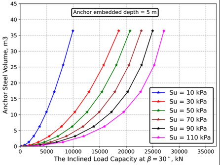

# Anchors Library

This subpackage of FAModel contains the Anchor class as well as modules for analytical static anchor capacity assessment. 

## Anchor Class
The anchor class contains properties and methods related to mooring anchors.

The anchor class stores properties and methods that enable a wide range of modeling - from capacity to cost to loads, and more. 
The [anchor capacity modules](#anchor-capacity-modules) are integrated with the anchor class through the getAnchorCapacity() method.
 
### Anchor Files
Introduction 
Inspection of the folder: anchors_famodel

#### Anchor Capacity Files
- **capacity_plate** : getCapacityPlate
- **capacity_suction** : getCapacitySuction
- **capacity_torpedo** : getCapacityTorpedo
- **capacity_driven** : getCapacityDriven
- **capacity_dandg** : getCapacityDandG
- **capacity_helical** : getCapacityHelical
- **capacity_load** : getTransferFunction

#### Anchor Support Files
- **capacity_soils** : clay_profile, sand_profile and rock_profile
- **capacity_solvers** : fd_solver for non-linear solver
- **capacity_pycurves** : py_Matlock, py_API, py_Reese and py_Lovera
- **capacity_plots** : plot_driven, plot_suction, plot_helical,plot_plate, plot_dandg, plot_load, plot_pycurve

### Anchor Methods
- **setSoilProfile()** : Assign a bilinearly interpolated soil profile from the 4 nearest CPTs
- **makeMoorPyAnchor()** : Creates a MoorPy point object representing the anchor in a moorpy system
- **getMudlineForces()** : Finds forces on anchor at mudline using MoorPy Point.getForces method. Use max_force=True to obtain the maximum forces on that anchor from the platform.getWatchCircle() method. 
For more information on the getWatchCircle() calculations, see the [Platform ReadMe](../platform/README.md). An additional anchor.loads dictionary entry is included to describe the mudline load type. 
'mudline_load_type'='max' if max_force=True, and 'mudline_load_type'='current_state' if max_force=False.
- **getLugForces()** : Finds forces at the anchor lug location with getTransferFunction function in capacity_loads.py
- **getCapacityAnchor()** : Calls anchor capacity functions for the correct anchor type using the getLugForces embedded in the method
- **getSizeAnchor()** : Calls sizing anchor functions for the correct anchor type using the getLugForces embedded in the method
- **getFS()** : Computes safety factor for loads on the anchor
- **getCost()** : Finds costs of anchor from MoorProps and stores in design dictionary
- **getCombinedPlot()** : Create a plot showing the anchor and the inverse catenary overlay in the same coordinate system.

### Anchor Object Properties
- **r** : anchor [x,y,z] position
- **dd** : anchor design dictionary, containing geometric properties, soil properties at the anchor location, cost
- **ms** : moorpy system associated with this anchor point
- **aNum** : anchor index in array mooring list (generally only used for shared moorings)
- **mpAnchor** : moorpy point object that models this anchor
- **anchorCapacity** : dictionary with horizontal and vertical capacity of the anchor. Generally these are loads in [N], but can also be displacements (generally for driven or drilled and grouted piles)
- **loads** : dictionary of loads on the anchor, and the method used to obtain these loads (static or dynamic modeling). 
Loads include mooring line tension (T) with the angle of the load (theta) as well as horizontal (H) and vertical (V) loads components. 
The keys for these loads will either include an m (for loads at the mudline) or a (for loads at the anchor lug / main padeye).
- **soilProps** : dictionary of soil property information at the location of the anchor
- **failure_probability** : dictionary of probabilities for failure of the anchor

### Anchor Type Requirements

Different geometric properties and soil conditions are needed for each anchor type. See the [Anchor Capacity Modules](#anchor-capacity-modules) section for details on the requirements of each anchor type.

## Anchor Capacity Modules
The following list shows the required soil conditions, load information and geometrical properties involved in the anchors' capacity calculations. 
Soil classification for clay, sand and rock can be found in [Soil Classification Parameters](#soil-classification-parameters).
>[!NOTE] 
>Some anchor capacity functions require input loads at the anchor lug point. These loads can be sent in to the getAnchorCapacity() method, or the getAnchorCapacity() method will calculate the loads by calling getLugLoads(). 
The input loads must be maximum or large loads on the anchor.

### Soil Properties
Introduction to different soil types
- clay/mud
	- gamma (submerged soil unit weight) (kN/m^3)
	- Su (undrained shear strength of soil at mudline) (kPa)
	
- sand
	- gamma (submerged soil unit weight) (kN/m^3)
	- phi (internal friction angle) (deg)
	- Dr (relative density) (%)
	
- rock (weak rock up to UCS = 5 MPa)
	- UCS (unconfined compressive strength at failure) (MPa)
	- Em (rock mass modulus) (MPa)
		
### Soil Classification Parameters

The soft, medium, and hard clay soil classes are distinguished by the following parameter ranges: 
| Soil Type (clay)  | N-Value  |     Eff. Sat. Unit Weight, kN/m3  | Void Ratio | Natural Water Content in Sat. State, % | Undrained Shear Strength, kN/m2 |
|:-----------------:|:--------:|:---------------------------------:|:----------:|:--------------------------------------:|:-------------------------------:|
|     Very Soft     |  0 - 2   |             5.5 - 8.5             |  0.9 - 1.4 |                30 - 50                 |            0 - 12.5             |
|       Soft        |  2 - 4   |             5.5 - 8.5             |  0.9 - 1.4 |                30 - 50                 |            12.5 - 25            |
|       Medium      |  4 - 8   |             5.5 - 8.5             |  0.9 - 1.4 |                30 - 50                 |             25 - 50             |
|       Stiff       |  8 - 15  |             8.5 - 12              |    ~ 0.6   |                20 - 30                 |            50 - 100             |
|     Very Stiff    | 15 - 30  |             8.5 - 12              |    ~ 0.6   |                20 - 30                 |            100 - 200            |
|        Hard       |   < 30   |             8.5 - 12              |    ~ 0.6   |                20 - 30                 |              > 200              |

Sand can also be classified ranging from soft to hard, however only a single sand class is supported at this time. In the future, sand classes will follow the parameter ranges in the following table:

| Soil Type (sand) |  N-Value | Eff. Sat. Unit Weight, kN/m3 | Void Ratio | Natural Water Content in Sat. State, % | Eff. friction Angle | Relative density (%) |
|:----------------:|:--------:|:----------------------------:|:----------:|:--------------------------------------:|:-------------------:|:--------------------:|
|   Very   Loose   |    > 4   |            7 - 9.5           |    ~ 0.8   |                 25 - 30                |        < 30         |         < 15         |
|       Loose      |  4 - 10  |            7 - 9.5           |    ~ 0.8   |                 25 - 30                |       30 - 35       |        15 - 35       |
|     Compact      | 10 - 30  |          9.5 - 11.5          |   ~ 0.45   |                 12 - 16                |       35 - 40       |        35 - 65       |
|      Dense       | 30 - 50  |          9.5 - 11.5          |   ~ 0.45   |                 12 - 16                |       40 - 45       |       65 - 85        |
|    Very Dense    |   < 50   |          9.5 - 11.5          |   ~ 0.45   |                 12 - 16                |        > 45         |         > 85         |

Conversion Units

Z0 explanaition on the pile head reference and how for zlug > z0 mooring line is embedded and below the mudline elevation

### Loads
- Loads at mudline elevation
	- Tm, thetam (Tension and angle of the load on mudline)
	- Hm, Vm (Horizontal and vertical loads on mudline)
- Loads at mudline elevation
	- Ta, thetaa (Tension and angle of the load on padeye of anchor)
	- Ha, Va (Horizontal and vertical loads on padeye of anchor)
- Transfer functions: soil properties (profile)  mooring line properties (line_type, d and w), loads and zlug 

> [!NOTE] check getLugForces for more details on this transfer function from mudline to lug elevation (below the seabed)
The getTransferLoad function requires **maximum** mudline forces as an input. These forces can be sent in as a dictionary, or anchor.loads dictionary will be searched for 'Hm' and 'Vm' values with additional 
key-value pair 'mudline_force_type':'max' to indicate these mudline forces are maximums.
 
If there are no max mudline forces in the anchor.loads dictionary, getMudlineForces(max_force=True) will be called. Stores results in loads dictionary. 
If lug is at mudline or no lug provided, equates mudline forces with lug forces. 
>[!NOTE]
>The getTransferFunction function called by getLugForces() is tuned to work with maximum loads on the anchor. Some anchor configuration, load, and soil condition combinations may produce invalid results in getTransferFunction. 
For example, the output Va may show as negative. In that case, getLugForces() will warn the user of the invalidity of the result and assign the anchor lug forces = mudline forces.

-------------------------------------------------------------------------------
> [!IMPORTANT] 
> A positive zlug denotes a lug/padeye/bridle below the mudline, while a negative zlug denotes a lug/padeye/bridle above the mudline. Anchors in rock should have a zlug >= 0.

> [!NOTE] 
> Load inputs to the capacity functions (with the exception of driven & drilled and grouted anchors) are in kN, while the anchor loads dictionary is in N. This conversion is automatically completed in the getAnchorCapacity() 
function so no manual load conversion is required. Load outputs are automatically converted in the getAnchorCapacity function where necessary. 

-----------------------------------------------------------------------------
	
### Anchor Types
The supported anchor types are below, with the associated FAModel name in italics.
- Plate anchors 
  - *DEA* (drag-embedment anchors)
  - *SEPLA* (suction embedded plate anchors)
  - *DEPLA* (dynamically embedded plate anchors)
  - *VLA* (vertically loaded anchors)
  - *plate* (unspecified plate anchor)
- *suction_pile* (Suction caisson/ suction bucket anchors)
- *torpedo_pile* (Torpedo pile anchors)
- *helical_pile* (Helical pile anchors)
- *driven_pile*  (Driven pile anchors)
- *dandg_pile* (Drilled and grouted piles)

### Anchor geometrical properties
#### DEA/SEPLA/DEPLA/VLA/plate
- soil condition: clay 
- geometry
   - A (area of plate) (m^2)
   - zlug (embedded depth of bridle/padeye below mudline - positive is below mudline, negative is above mudline) (m)
   - beta (OPTIONAL - angle of plate with horizontal plane) (deg)
- loads
  - Ha, Va (horizontal and vertical loads on padeye of anchor)
  
#### suction_pile (Suction caisson/ suction bucket anchors)
- soil condition: clay and sand
- geometry
   - L (length of pile) (m)
   - D (diameter of pile) (m)
   - zlug (embedded depth of padeye below mudline) (m)
- loads
  - Ha, Va (horizontal and vertical loads on padeye of anchor)
  
#### torpedo_pile (Torpedo pile anchors)
- soil condition: clay
- geometry
   - D1 (wing diameter) (m)
   - D2 (shaft diameter) (m)
   - L1 (wing length) (m)
   - L2 (shaft length) (m)
   - zlug (embedded depth of padeye below mudline) (m)
- loads
  - Ha, Va (horizontal and vertical loads on padeye of anchor)

#### helical_pile (Helical pile anchors)
- soil condition: clay and sand 
- geometry
  - D (helix diameter) (m)
  - L (shaft length) (m)
  - d (shaft diameter) (m)
  - zlug (embedded depth of padeye below mudline) (m)
- loads
  - Ha, Va (horizontal and vertical loads on padeye of anchor)
  
#### driven_pile (Driven pile anchors)
- soil condition: clay, sand and (weak) rock
- geometry
  - L (length of pile) (m)
  - D (diameter of pile) (m)
  - zlug (embedded depth of padeye below mudline) (m)
- loads
  - Ha, Va (horizontal and vertical loads on padeye of anchor)
  
#### Output notes 
 The general output is a lateral and rotational displacement or bending moment. In getCapacityAnchor, the driven pile capacity function is called in a while loop with incremented horizontal 
 input forces until one of the displacements goes past set failure criteria, thus providing a horizontal force capacity output [N]. Vertical capacity [N] is already calculated within the driven pile capacity function.
  
 For non-rock soil, the hinge (bending moment) is also considered as a failure mode along with the lateral and rotational displacement 
 
#### dandg_pile (Drilled and grouted piles)
- soil condition: rock
- geometry
   - L (length of pile) (m)
   - D (diameter of pile) (m)
   - zlug (lug location) (m)
- loads
  - Ha, Va (horizontal and vertical loads on padeye of anchor)
  
#### Output notes
 The general output is a lateral and rotational displacement. In getAnchorCapacity, the drilled and grouted pile function is called in a while loop with incremented horizontal input forces 
 until one of the displacements goes past set failure criteria, thus providing a horizontal force capacity output [N]. Vertical capacity [N] is already calculated within the driven pile capacity function. 
 

### Model Fidelity

There are two levels of fidelity in these models:

- Level 1 basic models are soil-dependent capacity curves for a 
  range of anchor types based on performing curve fits to 
  published information in anchor manuals and standards. 
- Level 2 intermediate models are quantitative calculations for
  suction caissons and plate anchors that account for quantitative 
  soil properties as well as their variation with embedment depth.

This plot gives an example of the capacity curves that can be 
produced by the intermediate model (holding capacity for a suction
embedded plate anchor) as a function of surface shear strength:

### Implemented level-1 model anchor and soil types

|             | DEA       | Suction | VLA | SEPLA |
|-------------|-----------|---------|-----|-------|
| Soft clay   | X         | X       | X   | X     |
| Medium clay | X         | X       | X   | X     |
| Hard clay   | X         |         |     |       |
| Sand        | X         |         |     |       |

### Parameters needed for level-2 anchor capacity models

|        **Anchor type** | **Suction** | **Suction** | **VLA**  | **SEPLA** |
|------------------------|-------------|-------------|----------|-----------|
|        **Soil type**   | **Clay**    | **Sand**    | **Clay** | **Clay**  |
| **Anchor parameters**  |             |             |          |           |
|        Diameter        | x           | x           |          |           |
|        Length          | x           | x           |          |           |
|        Area            |             |             | X        | X         |
|        Thickness       | ratio       | ratio       | ratio    | ratio     |
|       Embedment depth  |             |             | X        | X         |
| **Soil parameters**    |             |             |          |           |
|        gamma           | X           | X           | X        | X         |
|        Su0             | X           |             | X        | X         |
|        k               | X           |             | X        | X         |
|        alpha           | X           |             |          |           |
|        phi             |             | X           |          |           |

These models will continue to be expanded as data sources and time permit.

