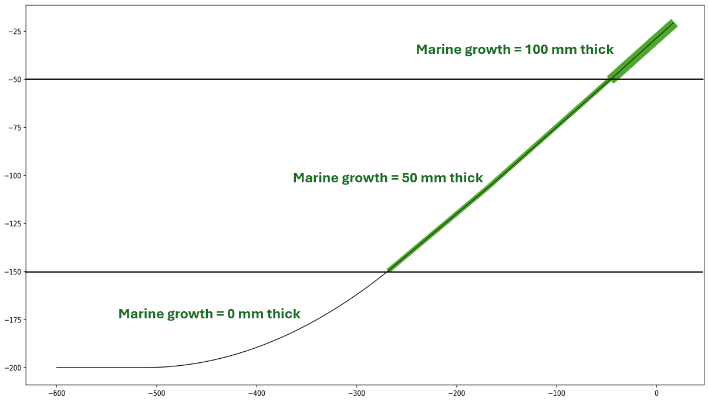

# Moorings, Sections, and Connectors

This file contains information on Mooring class and the subcomponent classes, [Section](#the-section-class) and [Connector](#the-connector-class).
The layout of this file is as follows:
## Layout
* [The Mooring Class](#the-mooring-class)
	* [Mooring Properties](#mooring-properties)
	* [Mooring Methods](#mooring-methods)
* [The Section Class](#the-section-class)
* [The Connector Class](#the-connector-class)
* [Marine Growth Modeling](#marine-growth-modeling)
	* [Marine Growth Modeling Methodology](#marine-growth-modeling-methodology)
	* [Marine Growth Calculations](#marine-growth-calculations)
	* [Marine Growth Dictionary](#marine-growth-dictionary)


## The Mooring Class

The Mooring class provides a data structure for design information of a mooring line. Design information 
includes a design dictionary with the following details:
- zAnchor  : Anchor depth
- rad_fair : Fairlead radius
- z_fair   : Fairlead depth 
- span     : 2D distance from fairlead to anchor (or fairlead to fairlead)
- Subcomponents: List of line sections and connectors in order from end A to end B
    The values in each subcomponent type vary depending on if it is a section or connector. For sections:
		- type : material property dictionary
			- d_nom, d_vol : diameter (nominal and volume-equivalent) [m]
			- material
			- cost [USD]
			- m : linear mass [g/m]
			- w : weight [N/m]
			- MBL : minimum breaking load [N]
			- EA : stiffness coefficient [N]
		- L : Line section length [m]
	For connectors:
	    - m : mass [kg]
		- v : volume [kg/m^3]
		- CdA 
	
The Mooring object contains subcomponent objects that represent each component of the full mooring line. Line segments are Section objects, while connectors between segments and at the ends of the lines are Connector objects. These segments alternate, and are listed in the subcomponents section of the design dictionary in order from end A to end B. If there are parallel sections, such as in the case of a bridle, the parallel sections are described with nested lists.

## Mooring Properties
- dd
: design description dictionary
- n_sec
: number of sections
- i_con
: indices of connectors in the subcomponents list
- i_sec
: indices of sections in the subcomponents list
- rad_anch
: anchoring radius
- rad_fair
: fairlead radius
- z_anch
: anchoring depth
- z_fair
: fairlead depth
- rA : end A absolute coordinates
- rB : end B absolute coordinates
- heading : compass heading from B to A
- ss : MoorPy subsystem representation of this Mooring, pristine
- ss_mod : modified MoorPy subsystem of thie Mooring, could have marine growth etc
- span : 2D (x-y) distance from fairlead to anchor or fairlead to fairlead. If bridles, the distance is calculated from the midpoint of all bridle fairlead points
- adjuster : custom function that can adjust mooring
- shared : int for anchored line (0), shared line (1) or half of a shared line (2)
- symmetric : boolean for if the mooring line is symmetric shared line
- rho : water density
- g : acceleration due to gravity
- envelopes : 2D motion envelopes, buffers, etc.
- reliability : dictionary of reliability information on the line
- cost : dictionary of line costs
- failure_probability : dictionary of failure probabilities


## Mooring methods

### update
Update the Mooring object based on the current state of the design dictionary, or, a new design dictionary.

### setSectionLength
Sets length of the section, including in the subsystem if there is one

### setSectionType
Sets lineType of section, including in the subsystem if there is one

### reposition
Adjusts mooring position based on changed platform location or heading, It can cll a custom "adjuster" function if one is provided. Otherwise it will just update the end positions.

### setEndPosition
Set the position of an end of the mooring

### getCost
Finds the cost based on the MoorPy subsystem cost estimates

### updateTensions
Gets tensions from subsystem and updates the max tensions dictionaries of each Section object if it is larger than a previous tension

### createSubsystem

Create a MoorPy subsystem for a line configuration from the design dictionary. Regular or suspended lines 
may be used.

### addMarineGrowth
Re-creates sections part of design dictionary to account for marine growth on the subsystem, then calls createSubsystem() to recreate the line. For a detailed explanation of the function and modeling methods behind it, see [Marine Growth Modeling](#marine-growth-modeling)


### addCorrosion
Calculates MBL of chain line with corrosion included

### getEnvelope
Computes the motion envelope of the Mooring based on the watch 
circle(s) of what it's attached to. If those aren't already 
calculated, this method will call the relevant getWatchCircle method

[Back to Top](#moorings-sections-and-connectors)
## The Connector Class

The Connector class provides a data structure for design information of a connector. 
The Connector class inherits from dict and Node.
The design dictionary includes
the following details: 
- connector type
	- mass
	- volume 
	- CdA
	
The connector class also contains an xyz location of the connector, and a connector object in MoorPy (mpConn).

## Connector methods

### makeMoorPyConnector

Create a MoorPy connector object in a MoorPy system. Mass, volume, and CdA are added as available from the design dictionary.

## The Section Class

The Section class provides a data structure for the mooring line section material and length. The Section class inherits from dict and Edge.

The line material properties (linear mass, material, MBL, Cd, etc) are stored in the type dictionary of the Section class. If a moorpy system is developed, the the line object representing this section is listed in the mpLine parameter. Loads are stored in the loads dictionary, and safety factors are stored in the safety_factors dictionary property.

### Section methods
- makeMoorPyLine
Create a moorpy line object in a moorpy system

[Back to Top](#moorings-sections-and-connectors)

## Marine Growth Modeling

FAModel models marine growth on mooring lines according to methods provided in DNVGL OS-E301 (2018) and DNV-RP-C205.

A dictionary of marine growth thicknesses and densities for different depth ranges can be input to the addMarineGrowth function, or the dictionary can be pulled from the project class marine_growth property, which can be set by the user or read in from the yaml. See [Marine Growth Dictionary](#marine-growth-dictionary) for a detailed explanation of the dictionary makeup.

### Marine Growth Modeling Methodology

The marine growth method Mooring.addMarineGrowth() uses the depth of the line at node points to determine cutoff points where different levels of marine growth should be added. For each segment of line, the end points of the segment are compared to the depth ranges of marine growth thicknesses in the dictionary to determine what marine growth thickness(es) that section should include, and where along the line each thickness should be added. If there are multiple thicknesses in one line segment, the segment is "split" into separate segments, with each assigned its associated marine growth thickness.

For example, the figure below shows a catenary line, made up of a single segment of chain. We can then add marine growth, specifying 100 mm of marine growth thickness for the depth range 0-50 m, 50 mm for depths between 50-100 m, and no marine growth for depths lower than 100 m. The line, initially 1 segment, now has 3 distinct segments to reflect the different marine growth thicknesses.



The appropriate thickness is then added to the line diameter, and the line mass, weight, and drag coefficient are updated as described in the [Marine Growth Calculations](#marine-growth-calculations). 

The additional weight of marine growth can cause the mooring line to sag significantly, which may lower the depth of the marine growth thickness change. To ensure the point of change between thicknesses matches the depths specified in the marine growth dictionary, the mooring.addMarineGrowth() is called in a while loop within project.getMarineGrowth(), where the difference between the initial and actual depths of change is used to update the inputs to mooring.addMarineGrowth() until the points of change are within the specified tolerance of the initial points of change.


Marine growth is currently not modeled on connectors or platforms.

### Marine Growth Calculations

The mass per unit length of marine growth on a line is calculated with the following formula:
```math
M_{growth} = \frac{\pi}{4}\left[(D_{nom}+2\Delta T_{growth})^2-D_{nom}^2\right]\rho_{growth}\mu
```
Where $\rho_{growth}$ is the density of marine growth, $D_{nom}$ is the nominal diameter of the pristine line, $\Delta T_{growth}$ is the thickness of the marine growth layer, and $\mu$ can be taken as 2.0 for chains or 1.0 for wire ropes. In the absence of further information, 1.0 is used for all rope materials such as polyester, and all cables.

Similarly, the submerged weight per unit length of the marine growth can be determined with the following formula:
```math
W_{growth} = M_{growth}\left[1-\frac{\rho_{seawater}}{\rho_{growth}}\right]g
```
Where $M_{growth}$ is the mass of marine growth on the line, $\rho_{seawater}$ is the density of the liquid the line is submerged in, and $g$ is the acceleration due to gravity.

>[!NOTE]
>The calculation for marine growth on cable sections with buoyancy modules requires a different approach. See the Marine Growth on Dynamic Cables section in the [Cables ReadMe](../cables/README.md) for more information.

The formula for calculation of marine growth in the DNVGL OS-E301 standard is as follows:
```math
C_{D_{growth}} = C_D \left[\frac{D_{nom}+2\Delta T_{growth}}{D_{nom}}\right]
```
Where $C_D$ is the drag coefficient for the pristine line. This formula assumes the drag coefficient is relative to the nominal diameter, as shown by the use of $D_{nom}$ in the formula. Drag coefficients in MoorDyn are based on the volume equivalent diameter, $D_{ve}$, requiring that a conversion factor between $D_{ve}$ and $D_{nom}$ be added to this equation. However, the ratio between $D_{ve}$ and $D_{nom}$ is altered by the addition of marine growth, so the conversion factor must be re-determined based on the new ratio between $D_{ve}$ and $D_{nom}$.

The new $D_{ve}$ can be determined by first calculating the air and submerged weights per unit length of the line with marine growth, and then using the difference in these values to find the weight per unit length of the water displaced by the line. From there, we can then determine the volume per unit length (area) of the line and subsequently the volume-equivalent diameter, as shown in the equations below:
```math
W_{seawater} = M_{pristine}g + M_{growth}g - (W_{pristine}+W_{growth})
```
```math
A=\frac{W_{seawater}}{\rho_{seawater}g}
```
```math
D_{ve} = \sqrt{\frac{4A}{\pi}}
```
Once $D_{ve}$ has been determined, the new volumetric-equivalent drag coefficient can be calculated with the following formula:
```math
C_{D_{growth-ve}} = C_{D_{ve}}\left(\frac{D_{ve_{pristine}}}{D_{nom_{pristine}}}\right) \left(\frac{D_{nom_{growth}}}{D_{nom_{pristine}}}\right) \left(\frac{D_{nom_{pristine}}}{D_{ve_{growth}}}\right)
```
Where $C_{D_{ve}}$ is the volume equivalent drag coefficient for the pristine line, $D_{ve_{pristine}}$ is the volume-equivalent diameter for the pristine line, $D_{nom_{pristine}}$ is the nominal diameter for the pristine line, $D_{nom_{growth}}$ is the nominal diameter with marine growth, and $D_{ve_{growth}}$ is the volume-equivalent diameter with marine growth.

The first ratio in parentheses of the equation above is the conversion factor from $C_{D_{ve}}$ to $C_{D_{nom}}$. The second ratio is the same as the ratio in the equation provided by DNV, which serves to increase the drag coefficient based on the ratio of nominal diameters. The third ratio reconverts from the nominal to the volume equivalent diameter, and accounts for the use of the marine growth volume-equivalent diameter in MoorDyn’s calculation of drag force, as explained below. The calculation of the drag force can be determined using the equation below:
```math
F_D = \rho C_DA|v|v

```
Where A is the area of the line defined as $A=length*diameter$, $\rho$ is the density of fluid, and $v$ is the velocity of the fluid.

Since the drag force calculation depends on the diameter, DNVGL OS-E301_2018 specifies that the pristine nominal diameter should be used to determine the drag force in the area calculation, and only the drag coefficient should be changed to reflect the increase in drag from marine growth. However, MoorDyn utilizes the volume equivalent marine growth diameter for its calculations. To ensure that the resulting drag force will be equivalent, the drag coefficient entered into MoorDyn needs to use the pristine line nominal diameter in the numerator of the last ratio, rather than the marine growth nominal diameter. 

### Marine Growth Dictionary
The Marine growth dictionary is made of the following sections:
- th : a list of lists. Each entry is a list with the following contents:
	[t, z_lower, z_upper] where t is the thickness of marine growth, z_lower is the lower limit of the depth this marine growth thickness is found at, and z_upper is the upper limit of the depth this marine growth thickness is found at. 
- rho : either a float or a list. If it is a float, this is the density of marine growth for all depths. If it is a list, the index corresponds index in the th list.
- buoys : a list of marine growth thicknesses for buoyant sections of dynamic power cables. Marine growth on power cables is modeled differently than for mooring lines. See the Marine Growth on Dynamic Cables section in the [Cables ReadMe](../cables/README.md) for more information.

[Back to Top](#moorings-sections-and-connectors)
