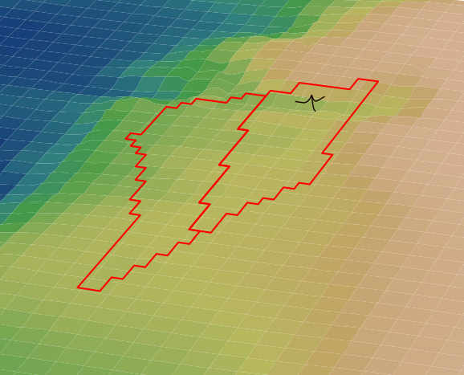
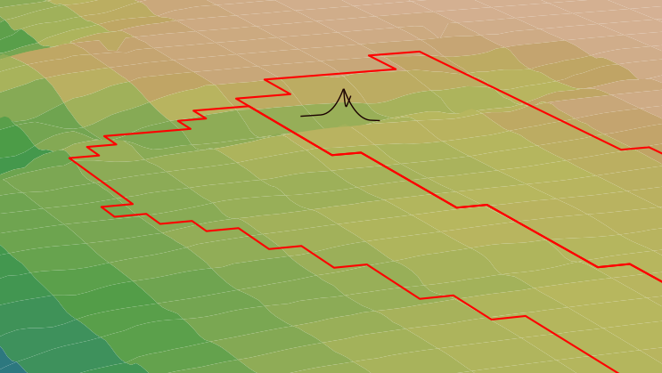
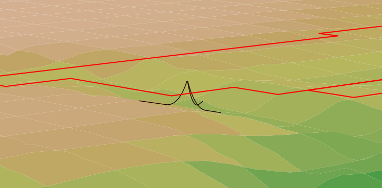

# seabed library

The seabed subpackage provides a set of functions for inputting and 
processing "seabed" information, including bathymetry, soil properties,
and other spatial properties of a lease area such as the lease area
boundary. 

## images

Views of a mooring system in the Humboldt Wind Energy Area over bathymetry.

## seabed slope

Views showing the mooring lines of a mooring system following the local seabed slopes.

## functions

### processASC

Processes an ASC file of bathymetry information and convert into
a rectangular bathymetry grid in units of me relative to the 
project reference point.

### processBoundary

Reads boundary information from a CSV file and stores the boundary 
coordinate list in a set of arrays. This function can be extended to
deal with multiple boundary sets.

