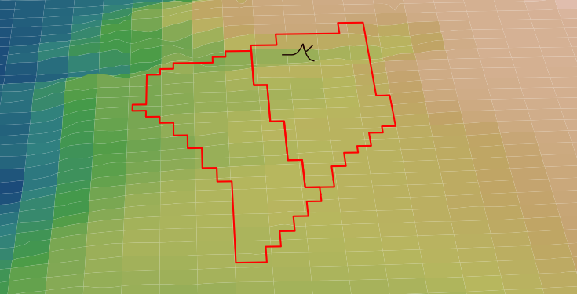
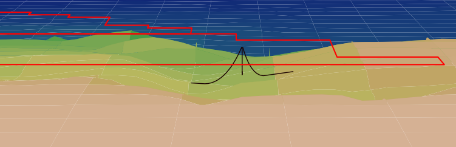

# Seabed Library

The seabed subpackage provides a set of functions for inputting and 
processing "seabed" information, including bathymetry, soil properties,
and other spatial properties of a lease area such as the lease area
boundary. 

## Bathymetry

MoorPy (the quasi-static mooring analysis tool) can be used to model 
mooring systems in geographically-accurate locations, including the 
local seabed bathymetry. An example mooring system and the bathymetry 
of the Humboldt Wind Energy Area are shown below, with the mooring 
lines of the mooring system following the slope of the local seabed.
The lease area boundaries are drawn in red at the water line.

## Functions

### processASC

Processes an ASC file of bathymetry information and converts into
a rectangular bathymetry grid in units of meters relative to the 
project reference point.

### processBoundary

Reads boundary information from a CSV file and stores the boundary 
coordinate list in a set of arrays. This function can be extended to
deal with multiple boundary sets.

